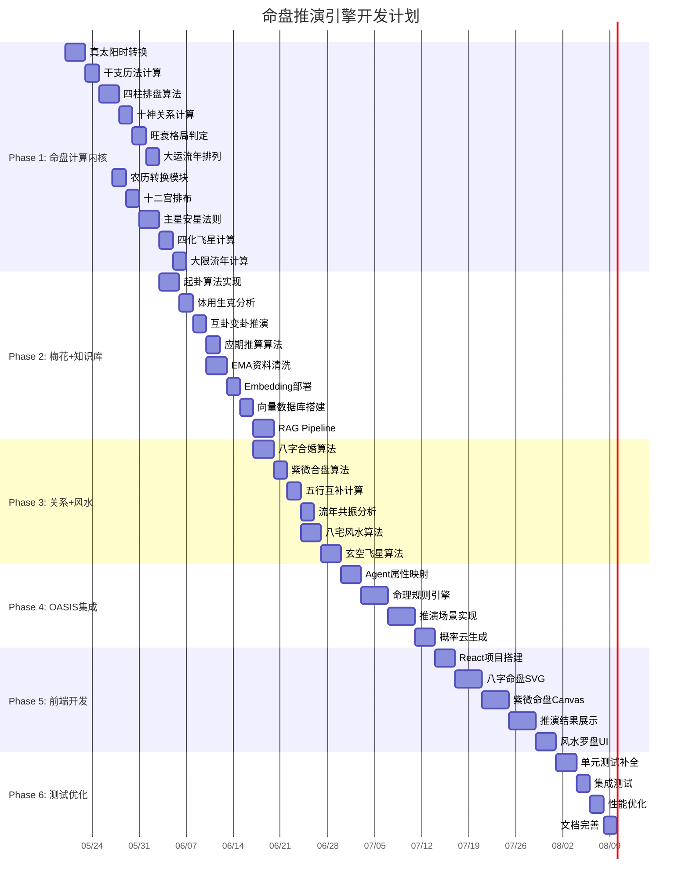

# 命盘推演引擎 - 开发计划

## 📅 项目时间线

### 总体规划

- **项目启动**: 2026-05-20
- **预计完成**: 2026-08-08
- **总工期**: 约12周（含缓冲）

---

## 🎯 里程碑

| 里程碑 | 目标日期 | 交付物 | 状态 |
|--------|----------|--------|------|
| M1: 命盘计算内核 | 2026-06-03 | 八字/紫微引擎 | ⬜ 未开始 |
| M2: 梅花+知识库 | 2026-06-17 | 梅花引擎+RAG | ⬜ 未开始 |
| M3: 关系+风水 | 2026-06-27 | 合盘/风水算法 | ⬜ 未开始 |
| M4: OASIS集成 | 2026-07-11 | 推演仿真服务 | ⬜ 未开始 |
| M5: 前端完成 | 2026-08-01 | 完整前端应用 | ⬜ 未开始 |
| M6: 测试上线 | 2026-08-08 | 测试报告+部署 | ⬜ 未开始 |

---

## 📊 甘特图



---

## 📋 详细任务清单

### Phase 1: 命盘计算内核 (2周)

#### Week 1: 八字排盘引擎 (2026-05-20 ~ 2026-05-26)

| 任务 | 负责人 | 预计工时 | 状态 | 备注 |
|------|--------|----------|------|------|
| 真太阳时转换算法 | 开发者A | 6h | ⬜ | 使用Skyfield |
| 干支历法计算 | 开发者A | 4h | ⬜ | 节气、月建 |
| 四柱排盘算法 | 开发者A | 6h | ⬜ | 核心算法 |
| 十神关系计算 | 开发者A | 4h | ⬜ | 十神表 |
| 旺衰判定算法 | 开发者A | 4h | ⬜ | 得令得地得势 |
| 格局判定算法 | 开发者A | 4h | ⬜ | 正官格、七杀格等 |
| 大运流年排列 | 开发者A | 4h | ⬜ | 起运岁数、顺逆 |
| 单元测试编写 | 开发者A | 6h | ⬜ | 覆盖率>90% |

#### Week 2: 紫微斗数引擎 (2026-05-27 ~ 2026-06-02)

| 任务 | 负责人 | 预计工时 | 状态 | 备注 |
|------|--------|----------|------|------|
| 农历转换模块 | 开发者B | 4h | ⬜ | lunardate |
| 十二宫排布算法 | 开发者B | 6h | ⬜ | 安命宫、身宫 |
| 主星安星法则 | 开发者B | 8h | ⬜ | 14主星 |
| 辅星煞星安星 | 开发者B | 6h | ⬜ | 六吉六煞 |
| 四化飞星计算 | 开发者B | 4h | ⬜ | 三合派 |
| 飞星派排盘 | 开发者B | 6h | ⬜ | 高级选项 |
| 大限流年计算 | 开发者B | 4h | ⬜ | 十年大限 |
| 单元测试编写 | 开发者B | 6h | ⬜ | 覆盖率>90% |

---

### Phase 2: 梅花易数 + 知识库RAG (2周)

#### Week 3: 梅花易数引擎 (2026-06-03 ~ 2026-06-09)

| 任务 | 负责人 | 预计工时 | 状态 | 备注 |
|------|--------|----------|------|------|
| 时间起卦算法 | 开发者A | 4h | ⬜ | 年月日时起卦 |
| 数字起卦算法 | 开发者A | 3h | ⬜ | 报数起卦 |
| 方位起卦算法 | 开发者A | 3h | ⬜ | 八方起卦 |
| 体用生克分析 | 开发者A | 4h | ⬜ | 体卦用卦 |
| 互卦变卦推演 | 开发者A | 4h | ⬜ | 互卦变卦 |
| 万物类象数据库 | 开发者A | 6h | ⬜ | 八卦类象 |
| 应期推算算法 | 开发者A | 4h | ⬜ | 近日远月 |
| 单元测试编写 | 开发者A | 4h | ⬜ | 覆盖率>90% |

#### Week 4: 知识库RAG系统 (2026-06-10 ~ 2026-06-16)

| 任务 | 负责人 | 预计工时 | 状态 | 备注 |
|------|--------|----------|------|------|
| EMA资料清洗 | 开发者C | 8h | ⬜ | 4个资料库 |
| JSON知识图谱 | 开发者C | 6h | ⬜ | 结构化抽取 |
| Embedding模型部署 | 开发者C | 4h | ⬜ | text2vec |
| Milvus搭建 | 开发者C | 4h | ⬜ | 向量数据库 |
| RAG检索Pipeline | 开发者C | 6h | ⬜ | LangChain |
| LLM解读服务 | 开发者C | 6h | ⬜ | vLLM部署 |
| 知识库导入脚本 | 开发者C | 4h | ⬜ | 批量导入 |
| 测试验证 | 开发者C | 4h | ⬜ | 检索质量 |

---

### Phase 3: 关系网络与风水 (1.5周)

#### Week 5: 人际关系耦合 (2026-06-17 ~ 2026-06-23)

| 任务 | 负责人 | 预计工时 | 状态 | 备注 |
|------|--------|----------|------|------|
| 八字合婚算法 | 开发者B | 6h | ⬜ | 干支合化 |
| 紫微合盘算法 | 开发者B | 6h | ⬜ | 三方四正 |
| 五行互补计算 | 开发者B | 4h | ⬜ | 五行平衡 |
| 流年共振分析 | 开发者B | 4h | ⬜ | 多人流年 |
| 综合评分算法 | 开发者B | 4h | ⬜ | 加权评分 |
| API接口开发 | 开发者B | 4h | ⬜ | REST API |
| 测试用例 | 开发者B | 4h | ⬜ | 边界测试 |

#### Week 6前半: 风水环境模块 (2026-06-24 ~ 2026-06-27)

| 任务 | 负责人 | 预计工时 | 状态 | 备注 |
|------|--------|----------|------|------|
| 命卦计算 | 开发者A | 4h | ⬜ | 东四命西四命 |
| 八宅风水算法 | 开发者A | 6h | ⬜ | 八方吉凶 |
| 玄空飞星算法 | 开发者A | 8h | ⬜ | 运盘山盘向盘 |
| 流年紫白飞星 | 开发者A | 4h | ⬜ | 九宫飞星 |
| 命盘联动分析 | 开发者A | 4h | ⬜ | 命卦与风水 |
| API接口开发 | 开发者A | 4h | ⬜ | REST API |

---

### Phase 4: OASIS嫁接 (2周)

#### Week 6后半 - Week 7: OASIS集成 (2026-06-30 ~ 2026-07-11)

| 任务 | 负责人 | 预计工时 | 状态 | 备注 |
|------|--------|----------|------|------|
| Agent属性映射 | 开发者C | 6h | ⬜ | 命盘→Agent |
| 命理规则引擎 | 开发者C | 8h | ⬜ | 规则→效用函数 |
| 环境系统设计 | 开发者C | 6h | ⬜ | 流年风水变量 |
| 创业场景实现 | 开发者C | 6h | ⬜ | 合伙创业 |
| 婚姻场景实现 | 开发者C | 6h | ⬜ | 婚姻推演 |
| 搬迁场景实现 | 开发者C | 4h | ⬜ | 搬迁推演 |
| 合作场景实现 | 开发者C | 4h | ⬜ | 商业合作 |
| 概率云生成 | 开发者C | 6h | ⬜ | 多次采样 |
| 热力图数据 | 开发者C | 4h | ⬜ | 可视化数据 |

---

### Phase 5: 前端与交互 (3周)

#### Week 9: 核心UI框架 (2026-07-14 ~ 2026-07-18)

| 任务 | 负责人 | 预计工时 | 状态 | 备注 |
|------|--------|----------|------|------|
| React项目搭建 | 开发者D | 4h | ⬜ | Vite+TS |
| 路由系统设计 | 开发者D | 3h | ⬜ | React Router |
| 状态管理方案 | 开发者D | 3h | ⬜ | Zustand |
| API对接层 | 开发者D | 4h | ⬜ | Axios封装 |
| 基础组件库 | 开发者D | 6h | ⬜ | Ant Design |
| 布局组件 | 开发者D | 4h | ⬜ | Header/Sidebar |
| 主题配置 | 开发者D | 3h | ⬜ | 暗色主题 |

#### Week 10: 命盘可视化 (2026-07-21 ~ 2026-07-25)

| 任务 | 负责人 | 预计工时 | 状态 | 备注 |
|------|--------|----------|------|------|
| 八字命盘SVG | 开发者D | 8h | ⬜ | 四柱展示 |
| 十神标注 | 开发者D | 4h | ⬜ | 十神显示 |
| 五行力量图 | 开发者D | 4h | ⬜ | 雷达图 |
| 紫微命盘Canvas | 开发者D | 8h | ⬜ | 十二宫 |
| 主星辅星显示 | 开发者D | 4h | ⬜ | 星曜图标 |
| 四化标注 | 开发者D | 3h | ⬜ | 化禄权科忌 |
| 大运时间轴 | 开发者D | 4h | ⬜ | 时间轴组件 |

#### Week 11: 推演结果展示 (2026-07-28 ~ 2026-08-01)

| 任务 | 负责人 | 预计工时 | 状态 | 备注 |
|------|--------|----------|------|------|
| 推演配置界面 | 开发者D | 6h | ⬜ | 场景选择 |
| 运势热力图 | 开发者D | 6h | ⬜ | ECharts |
| 概率云可视化 | 开发者D | 6h | ⬜ | 分布图 |
| 关系网络图 | 开发者D | 6h | ⬜ | D3.js |
| 风水罗盘UI | 开发者D | 6h | ⬜ | Canvas |
| 决策建议卡片 | 开发者D | 4h | ⬜ | 卡片组件 |

---

### Phase 6: 测试与优化 (1周)

#### Week 12: 测试与优化 (2026-08-04 ~ 2026-08-08)

| 任务 | 负责人 | 预计工时 | 状态 | 备注 |
|------|--------|----------|------|------|
| 单元测试补全 | 全员 | 8h | ⬜ | 覆盖率>80% |
| 集成测试 | 全员 | 6h | ⬜ | API测试 |
| E2E测试 | 开发者D | 6h | ⬜ | Playwright |
| 性能优化 | 开发者C | 8h | ⬜ | 缓存、索引 |
| 安全审计 | 开发者C | 4h | ⬜ | 漏洞扫描 |
| 文档完善 | 全员 | 6h | ⬜ | API文档 |
| 部署脚本 | 开发者C | 4h | ⬜ | Docker/K8s |
| 用户手册 | 开发者D | 4h | ⬜ | 使用指南 |

---

## 👥 团队分工

### 角色定义

| 角色 | 人数 | 职责 |
|------|------|------|
| **项目经理** | 1 | 项目规划、进度管理、风险控制 |
| **后端开发** | 2 | 命理算法、API开发、服务端逻辑 |
| **AI工程师** | 1 | RAG系统、LLM部署、OASIS集成 |
| **前端开发** | 1 | UI开发、可视化、交互设计 |
| **测试工程师** | 1 | 测试用例、质量保证 |

### 人员分配

| 人员 | 角色 | 主要负责模块 |
|------|------|--------------|
| 开发者A | 后端开发 | 八字引擎、梅花引擎、风水模块 |
| 开发者B | 后端开发 | 紫微引擎、关系耦合 |
| 开发者C | AI工程师 | 知识库RAG、OASIS集成 |
| 开发者D | 前端开发 | 前端UI、可视化 |
| 开发者E | 测试工程师 | 测试、质量保证 |

---

## 🎯 关键路径

```
真太阳时 → 八字排盘 → 紫微排盘 → 合盘分析 → OASIS推演
    ↓           ↓           ↓           ↓           ↓
  Week1      Week1-2      Week2       Week5       Week7
```

**关键依赖**：
1. 八字排盘是所有模块的基础
2. 紫微排盘依赖农历转换
3. 合盘分析依赖八字和紫微
4. OASIS推演依赖所有计算模块

---

## ⚠️ 风险管理

### 技术风险

| 风险 | 概率 | 影响 | 应对措施 |
|------|------|------|----------|
| 命理算法准确性 | 中 | 高 | 多源验证、专家审核 |
| 紫微流派冲突 | 高 | 中 | 策略模式、可配置 |
| OASIS集成复杂 | 中 | 高 | 预研、分阶段集成 |
| LLM推理性能 | 中 | 中 | 模型量化、缓存 |
| 前端可视化复杂 | 低 | 中 | 组件化、复用 |

### 进度风险

| 风险 | 概率 | 影响 | 应对措施 |
|------|------|------|----------|
| 算法开发延期 | 中 | 高 | 预留缓冲时间 |
| 知识库数据质量 | 中 | 中 | 人工审核、迭代优化 |
| 人员变动 | 低 | 高 | 文档完善、知识转移 |

### 合规风险

| 风险 | 概率 | 影响 | 应对措施 |
|------|------|------|----------|
| 应用审核拒绝 | 中 | 高 | 合规定位、中性表述 |
| 法律法规变化 | 低 | 高 | 法律咨询、及时调整 |

---

## 📊 进度跟踪

### 每周站会

- **时间**: 每周一 10:00
- **内容**: 进度汇报、问题讨论、计划调整
- **工具**: 飞书/钉钉/腾讯会议

### 进度看板

使用Jira/Trello/飞书多维表格跟踪任务状态：

```
┌─────────┬─────────┬─────────┬─────────┬─────────┐
│  待办   │  进行中 │  测试中 │  完成   │  阻塞   │
├─────────┼─────────┼─────────┼─────────┼─────────┤
│ Task 1  │ Task 3  │ Task 5  │ Task 7  │ Task 9  │
│ Task 2  │ Task 4  │ Task 6  │ Task 8  │         │
│         │         │         │         │         │
└─────────┴─────────┴─────────┴─────────┴─────────┘
```

### 周报模板

```markdown
# 周报 - 第X周 (2026-XX-XX ~ 2026-XX-XX)

## 本周完成
- [x] 任务1
- [x] 任务2

## 下周计划
- [ ] 任务3
- [ ] 任务4

## 遇到的问题
- 问题描述
- 解决方案

## 需要的支持
- 支持内容
```

---

## 🎉 项目验收

### 验收标准

1. **功能完整性**
   - 所有核心功能实现
   - API接口完整
   - 前端界面可用

2. **性能指标**
   - 八字排盘 < 100ms
   - 紫微排盘 < 200ms
   - OASIS推演 < 5s
   - 页面加载 < 3s

3. **质量指标**
   - 单元测试覆盖率 > 80%
   - 无严重Bug
   - 文档完整

4. **合规要求**
   - 产品定位清晰
   - 输出措辞合规
   - 隐私保护到位

### 交付物清单

- [ ] 源代码（Git仓库）
- [ ] 数据库脚本
- [ ] Docker配置
- [ ] 部署文档
- [ ] API文档
- [ ] 用户手册
- [ ] 测试报告
- [ ] 性能报告

---

**文档版本**: v1.0.0  
**最后更新**: 2026-05-17  
**维护者**: MingPanEngine Team